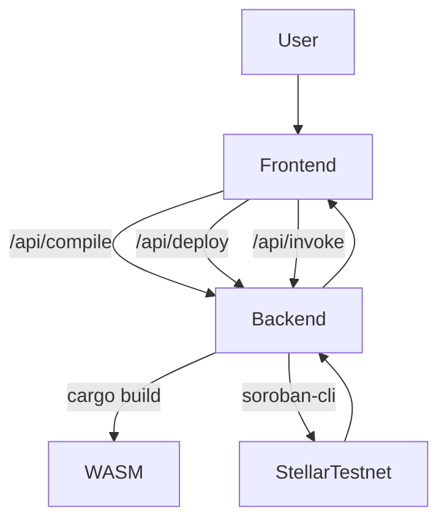

# System Architecture

## Overview

Soroban Playground is designed as a scalable, developer-friendly monorepo, splitting responsibilities between a React/Next.js frontend and a Node.js Express backend.

## Frontend Architecture (Next.js)
- **Monaco Editor**: Handles high-performance code editing with Rust syntax highlighting.
- **State Management**: React Hooks (`useState`, `useEffect`) manage the workflow states (`isCompiling`, `isDeploying`) and store the ephemeral contract information (Simulator vs Live).
- **Styling**: TailwindCSS provides a modern, dark-themed responsive layout out-of-the-box.
- **API Interactions**: The frontend communicates via REST JSON endpoints provided by the backend.

## Backend Architecture (Node.js/Express)
- **Compilation Engine**: Uses Node.js `child_process` (`exec`) to run `cargo build --target wasm32-unknown-unknown` against temporary scoped directories.
- **Deployment Engine**: Invokes the `soroban contract deploy` CLI command, returning the `Contract ID`.
- **Invocation Engine**: Invokes the `soroban contract invoke` CLI command to read/write state based on frontend form inputs.

## Scaling Considerations (For Future Updates)
- Use **Docker Containers** instead of raw `child_process` for secure compilation environments on a live server.
- Introduce a Database (PostgreSQL/Redis) to store user sessions and save shareable playground environments.
