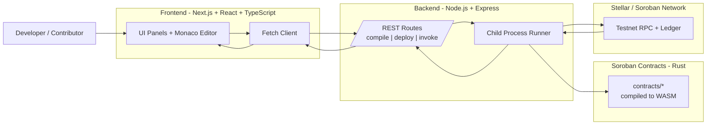

# Soroban Playground

Soroban Playground is a browser-based IDE for writing, compiling, deploying, and interacting with Stellar Soroban smart contracts.
No setup required. Write Rust smart contracts directly in your browser.

## Features
- **Code Editor**: Monaco-based editor with Rust syntax highlighting, auto-formatting, and contract templates.
- **In-browser Compilation**: Compile Soroban contracts online and view logs/WASM outputs.
- **Deploy to Testnet**: Deploy your contracts instantly to the Stellar Testnet.
- **Contract Interaction**: Read and write functions easily via an auto-generated UI.
- **Storage Viewer**: Explore contract storage keys and values.

## Tech Stack Diagram



### How To Read This Diagram
1. Start from the left: a contributor writes or updates contract code in the browser UI.
2. Follow the center: the frontend calls backend API routes for compile, deploy, and invoke actions.
3. End on the right: backend tools compile Rust contracts to WASM and interact with Soroban on Stellar Testnet, then return results to the UI.

### Stack At A Glance
- **Frontend** (`frontend/`): Next.js app router UI, Monaco editor integration, and interactive panels for compile/deploy/invoke flows.
- **Backend** (`backend/`): Express API routes (`/compile`, `/deploy`, `/invoke`) that orchestrate Soroban toolchain commands.
- **Smart Contracts** (`contracts/`): Example Soroban contracts written in Rust, compiled to WASM, and deployed/invoked via backend routes.
- **Toolchain**: Rust + Cargo + Soroban CLI for compilation and network interactions.

## Project Structure
This repository uses a monorepo setup:
- `frontend/`: The Next.js React application containing the UI.
- `backend/`: The Node.js Express application responsible for Soroban CLI interactions.

## Getting Started

### Prerequisites
- Node.js (v18+)
- NPM or Yarn
- Rust (for the backend compilation engine)
- Soroban CLI

### Local Setup
1. Clone the repository:
   ```bash
   git clone https://github.com/your-username/soroban-playground.git
   ```
2. Install dependencies for all workspaces:
   ```bash
   npm install
   ```
3. Start the application stack (Frontend and Backend concurrently):
   ```bash
   npm run dev
   ```

## Contributing
We welcome contributions! Please see our [CONTRIBUTING.md](./CONTRIBUTING.md) for guidelines on how to get started.

## License
MIT License.
